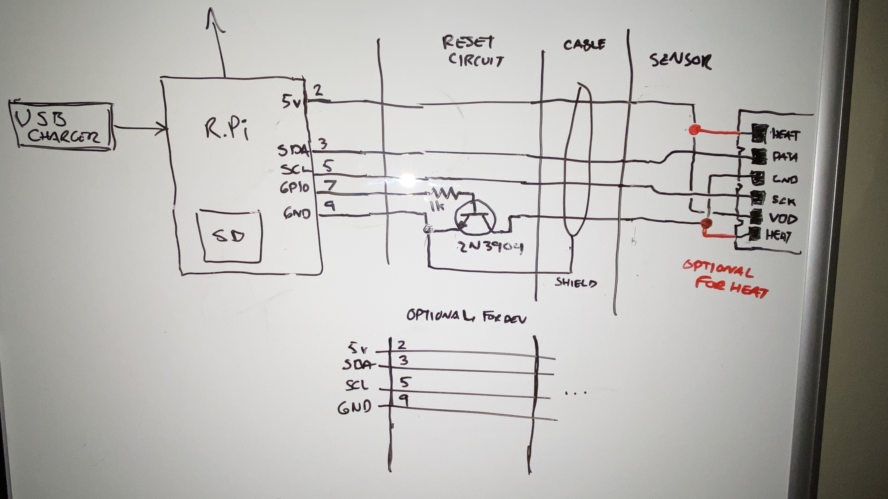
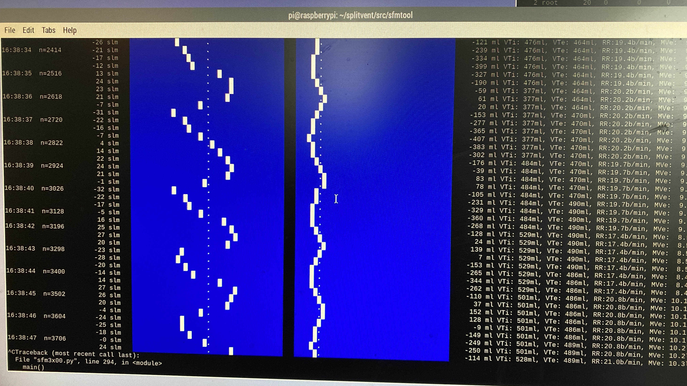

# *splitvent* - Designs and Tools to help multiply available Ventilators

This project includes designs for 3D-printed ventilator "Y" splitters, 3D printed flow restrictors, and Raspberry Pi software to monitor per-patient respiratory flow with a [Sensirion SFM-3x00 series inline flow sensor](https://www.sensirion.com/en/flow-sensors/mass-flow-meters-for-high-precise-measurement-of-gases/low-pressure-drop-mass-flow-meter/)

We are releasing our work early and often, and in a form that we hope interested individuals can reproduce. 

Contributors to this project submit their work under a Creative Commons ShareAlike 4.0 license. See `LICENSE.md` for more details

# News

* 2020-03-29 7:30PM EST - [Raspberry pi image now available for download](https://splitvent.s3.us-east-2.amazonaws.com/splitvent_rpi_image_20200329.zip)

# Quick Start

## Ventilator Y

* *Instructions coming soon*

## Monitoring Software

* Fabricate a cable to connect to the sensor's connector surface contact lands. 

* Connect your RPi to the Sensirion sensor as shown in the image below:
       

* Download the [RPi disk image](https://splitvent.s3.us-east-2.amazonaws.com/splitvent_rpi_image_20200329.zip), unzip, and write to an 8GB or greater SD card. Follow the [instructions here](https://www.raspberrypi.org/documentation/installation/installing-images/README.md)

* Install the SD card into the RPi

* Plug in an HDMI monitor

* Power on the RPi

You'll see a UI like this:

# 3D Printing Models

All models have been printed using FDM printers with PLA, but PETG may be used. All tests printed using 10-20% infill with supports touching buildplate

# Thanks to the following contributors:

  * Tobin Greensweig
  * Nate Surls
  * Paul Holland
  * Timothy Nisi
  * Paul Yearling
  * Brian Overshiner
  * Joe Koberg
  * [Dan Lash](https://www.linkedin.com/in/danlash)
  
  
